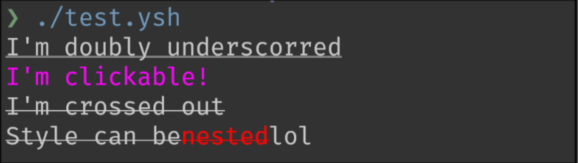

Originally https://github.com/oilshell/oil/pull/1912

## Termcodes

### Issues
- There's no way to actually test this because termcode commands has effect not on stdout/stderr but on other environments. 
- There's some biolerplates in the code. Begs macro system [#1872](https://github.com/oilshell/oil/issues/1872).

### TODOs
- [ ] Auto adapting colors with `$COLORTERM`
- [ ] Maybe delegate jobs to `tput` from ncurses if it's present. Since it's not really part of coreutils so this better stay optional. Not sure yet. 
- [ ] Nesting styles doesn't need to be fixed. 

### Resources 
- https://en.wikipedia.org/wiki/ANSI_escape_code
- https://invisible-island.net/xterm/ctlseqs/ctlseqs.html
- https://sw.kovidgoyal.net/kitty/graphics-protocol/

### Preview

